Prolific Calibration V317 6pics - 2500ms analysis
================

true

``` r
#plotting format
plotformat = theme(plot.title = element_text(face="bold",size = 17,hjust = 0.5),axis.title = element_text(face = "bold",size =15), axis.text.x = element_text(size=12), axis.title.y=element_text(size=14))+theme_bw()

theme_facet = function(base_size = 14, base_family = "Helvetica") {
  # Starts with theme_grey and then modify some parts
  theme_bw(base_size = base_size, base_family = base_family) %+replace%
    theme(
      strip.background = element_blank(),
      strip.text.x = element_text(size = 10),
      strip.text.y = element_text(size = 10),
      axis.text.x = element_blank(),
      axis.text.y = element_text(size=12,hjust=1),
      axis.ticks =  element_blank(), #element_line(colour = "black"), 
      axis.title.x= element_text(size=12),
      axis.title.y= element_text(size=12,angle=90),
      panel.background = element_blank(), 
      panel.border =element_blank(), 
      panel.grid.minor = element_blank(), 
      panel.spacing = unit(0.5, "lines"), 
      plot.background = element_blank(), 
      plot.margin = unit(c(0.3,  0.3, 0.3, 0.3), "lines"),
      axis.line.x = element_line(color="black", size = 0.5),
      axis.line.y = element_line(color="black", size = 0.5)
    )
}
```

``` r
time = '2500';
pilot_version = "70levels_V317";
dataPath = '/Volumes/Macintosh HD/Users/Pam_sf_wang/Documents/Perceptual_learning_project/Calibration/Calibration_analysis/Prolific_analysis/70levels/';


data_new_fname = paste0("Prolific_",pilot_version,"_",time,".csv")
demographic_new_fname = paste0("Prolific_",pilot_version,"_demographic",time,".csv")
postsurvey_new_fname = paste0("Prolific_",pilot_version,"_postsurvey",time,".csv")

postsurvey_dp_fname = paste0("Prolific_",pilot_version,"_survey_dp",time,".csv")

d_p_thre = 0.5
trial_thre = 99/100
age_thre = 35
```

load data
---------

``` r
totalData = read.csv(paste0(dataPath,data_new_fname),header = T)
totalData = totalData[,-1]
demographic_information = read.csv(paste0(dataPath,demographic_new_fname),header = T)
postsurvey = read.csv(paste0(dataPath,postsurvey_new_fname),header = T)
```

Identify and remove outliers
----------------------------

### no responses

``` r
summarize = dplyr::summarize
#check basic performance -- remove non-responding subjects
temp = totalData %>% group_by(subID,feature_index) %>% summarize(num_noresponses= sum(keys==-1), trialNum = length(subID), no_resp = sum(keys==-1)/trialNum)
sprintf("total trial number: %i; Number of subjects %i",temp$trialNum[1],dim(temp)[1])
```

    ## [1] "total trial number: 231; Number of subjects 35"

``` r
head(temp)
```

    ## # A tibble: 6 x 5
    ## # Groups:   subID [6]
    ##   subID   feature_index num_noresponses trialNum no_resp
    ##   <fct>           <int>           <int>    <int>   <dbl>
    ## 1 ""                  2               1      231 0.00433
    ## 2 04dc77b             3               0      231 0      
    ## 3 1140ee1             2              19      231 0.0823 
    ## 4 11a31fc             3               2      231 0.00866
    ## 5 11c37ec             1               0      231 0      
    ## 6 1273cfc             2              45     1155 0.0390

``` r
###quantile: use quantiles to determine the removal criteria
summary(temp$no_resp)
```

    ##     Min.  1st Qu.   Median     Mean  3rd Qu.     Max. 
    ## 0.000000 0.002165 0.004329 0.046757 0.034632 1.000000

``` r
noresp_thre = quantile(temp$no_resp,prob = trial_thre)
sprintf("the last 5percent of non-resp rate (threshold for excluding subjects): %f",noresp_thre)
```

    ## [1] "the last 5percent of non-resp rate (threshold for excluding subjects): 0.695325"

``` r
ggplot(temp, aes(y= no_resp, x= subID,color = as.factor(feature_index)))+
  geom_point()+
  geom_hline(yintercept=noresp_thre, linetype="dashed", color = "red", size=0.5)+
  labs(title="No responses", x ="subjuect ID", y = "number of no responses")+
  plotformat
```

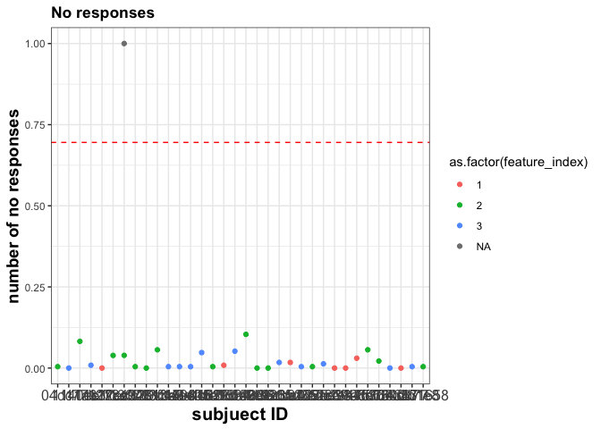

``` r
ggplot(temp, aes(y= no_resp, x= feature_index,color = as.factor(feature_index)))+
  geom_boxplot(fill = "white",lwd = 1)+
  geom_jitter(width=0.2,alpha = 0.5)+
  geom_hline(yintercept=noresp_thre, linetype="dashed", color = "red", size=0.5)+
  labs(title="No responses", x ="Feature type (3 in total)", y = "number of no responses")+
  plotformat
```

    ## Warning: Removed 1 rows containing missing values (stat_boxplot).

    ## Warning: Removed 1 rows containing missing values (geom_point).

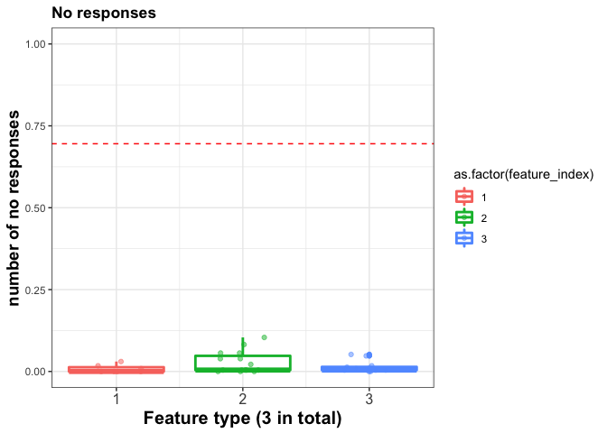

``` r
#no response subjects
removeSub = temp$subID[temp$no_resp>=noresp_thre]
totalData = totalData%>%filter(!subID %in% removeSub)
demographic_information = demographic_information%>%filter(!SubID %in%removeSub)


sprintf("remove no response subjects: %i; remain subjects %i",length(removeSub),length(unique(totalData$subID)))
```

    ## [1] "remove no response subjects: 1; remain subjects 33"

``` r
removeSub
```

    ## [1] 12ce948
    ## 34 Levels:  04dc77b 1140ee1 11a31fc 11c37ec 1273cfc 12ce948 ... f431658

Demographic information
-----------------------

``` r
genderCount = table(demographic_information$Gender)
EthnicityCount = table(demographic_information$Ethnicity)
RaceCount = table(demographic_information$Race)
genderCount
```

    ## 
    ##  F  M 
    ## 25 13

``` r
EthnicityCount
```

    ## 
    ##  HL NHL 
    ##   2  35

``` r
RaceCount
```

    ## 
    ##  A AA  M  O  W 
    ##  2  3  3  1 28

``` r
summary(demographic_information$Age)
```

    ##    Min. 1st Qu.  Median    Mean 3rd Qu.    Max.    NA's 
    ##   18.00   22.00   28.00   26.57   32.00   34.00       1

``` r
  ggplot(demographic_information, aes(demographic_information$Age)) + 
    geom_histogram()+
    geom_vline(xintercept=median(demographic_information$Age), linetype="dashed", color = "red", size=0.5)+
    #geom_vline(xintercept=mean(demographic_information$Age), linetype="dashed", color = "blue", size=0.5)+
    labs(title = "Age Distribution",x = "age", y = "counts")+
    plotformat
```

    ## `stat_bin()` using `bins = 30`. Pick better value with `binwidth`.

    ## Warning: Removed 1 rows containing non-finite values (stat_bin).

    ## Warning: Removed 1 rows containing missing values (geom_vline).

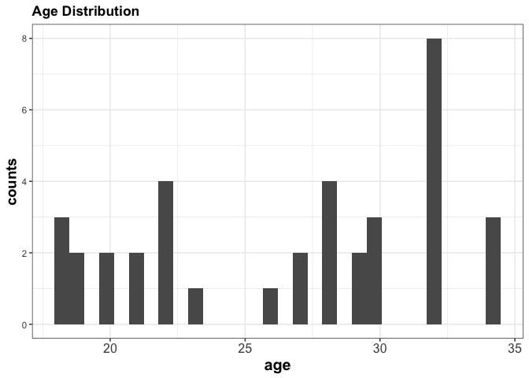

Restrict age
------------

### Remove subjects with age outside of the range we want

``` r
#select right age
remainSub = demographic_information$SubID[is.na(demographic_information$Age) | demographic_information$Age<=age_thre]
demographic_information_remain = filter(demographic_information,SubID%in%remainSub)
  
summary(demographic_information_remain$Age)
```

    ##    Min. 1st Qu.  Median    Mean 3rd Qu.    Max.    NA's 
    ##   18.00   22.00   28.00   26.57   32.00   34.00       1

``` r
ggplot(demographic_information_remain, aes(Age)) + 
  geom_histogram()+
  geom_vline(xintercept=median(demographic_information_remain$Age), linetype="dashed", color = "red", size=0.5)+
  #geom_vline(xintercept=mean(demographic_information$Age), linetype="dashed", color = "blue", size=0.5)+
  labs(title = "Age Distribution",x = "age", y = "counts")+
  plotformat
```

    ## `stat_bin()` using `bins = 30`. Pick better value with `binwidth`.

    ## Warning: Removed 1 rows containing non-finite values (stat_bin).

    ## Warning: Removed 1 rows containing missing values (geom_vline).


``` r
genderCount = table(demographic_information_remain$Gender)
EthnicityCount = table(demographic_information_remain$Ethnicity)
RaceCount = table(demographic_information_remain$Race)
genderCount
```

    ## 
    ##  F  M 
    ## 25 13

``` r
EthnicityCount
```

    ## 
    ##  HL NHL 
    ##   2  35

``` r
RaceCount
```

    ## 
    ##  A AA  M  O  W 
    ##  2  3  3  1 28

``` r
#remove subjects who are outside of the age range
removeSubAge = demographic_information$SubID[!is.na(demographic_information$Age) & demographic_information$Age>age_thre]
totalData = totalData %>%filter(subID %in%remainSub)
sprintf("remove over aged subejcts %i; remain subjects: %i", length(removeSubAge),length(unique(totalData$subID)))
```

    ## [1] "remove over aged subejcts 0; remain subjects: 33"

Add conditions
--------------

``` r
summarize = dplyr::summarize
#trial conditions: different:D; same:S (same as keys)
totalData$SameDiff = NA;
totalData$SameDiff[totalData$Fimg==totalData$Simg]="S";
totalData$SameDiff[totalData$Fimg!=totalData$Simg]="D";
  
totalData$feature_index = as.factor(totalData$feature_index)
  
#trial conditions: level
totalData$level_diff = as.factor(abs(totalData$Fimg-totalData$Simg))

#pair identity
temp = data.frame()
for (irow in 1:dim(totalData)[1]){
  tempPair = sort(c(totalData$Fimg[irow],totalData$Simg[irow]))
  tempName = paste(tempPair,collapse = "_")
  tempName = paste(tempName,totalData$feature_index[irow],sep="_F")
  totalData$PairIdentity[irow]=tempName
  rm(tempName)
}
```

Task structure
--------------

### Check number trials and number of subjects

``` r
temptrialNumbers=totalData %>%group_by(subID,feature_index,SameDiff)%>%summarize(num_same = length(SameDiff))
head(temptrialNumbers)
```

    ## # A tibble: 6 x 4
    ## # Groups:   subID, feature_index [3]
    ##   subID   feature_index SameDiff num_same
    ##   <fct>   <fct>         <chr>       <int>
    ## 1 ""      2             D             105
    ## 2 ""      2             S             126
    ## 3 04dc77b 3             D             105
    ## 4 04dc77b 3             S             126
    ## 5 1140ee1 2             D             105
    ## 6 1140ee1 2             S             126

``` r
temptrialNumbers %>%group_by(feature_index)%>%summarize(num_sub = length(subID)/2)
```

    ## # A tibble: 3 x 2
    ##   feature_index num_sub
    ##   <fct>           <dbl>
    ## 1 1                   7
    ## 2 2                  14
    ## 3 3                  12

Behavior analysis
-----------------

### Calculate d-prime using adjusted false alarm (FA) and adjusted hit rates

#### Overall d-prime: collapse across all feature types

``` r
summarize = dplyr::summarize
#over all performance
basic = totalData %>% filter(keys>=0, run==3)%>% group_by(subID)%>% summarize(
  hit = sum(keys==1&SameDiff=="S"), 
  fa= sum(keys==1&SameDiff=="D"), 
  cr = sum(keys==0&SameDiff=="D"),
  miss = sum(keys==0&SameDiff=="S"),
  HitRate =sum(keys==1&SameDiff=="S")/sum(SameDiff=="S"), 
  FARate = sum(keys==1&SameDiff=="D")/sum(SameDiff=="D"), 
  CRRate = sum(keys==0&SameDiff=="D")/sum(SameDiff=="D"),
  MissRate = sum(keys==0&SameDiff=="S")/sum(SameDiff=="S"), 
  adjFARate = 1/(2*sum(SameDiff=="D")),
  adjHitRate = 1-(1/(2*sum(SameDiff=="S"))),
  d_p = qnorm(HitRate)-qnorm(FARate),
  adjd_p=qnorm(adjHitRate)-qnorm(adjFARate))
head(basic)
```

    ## # A tibble: 6 x 13
    ##   subID   hit    fa    cr  miss HitRate FARate CRRate MissRate adjFARate
    ##   <fct> <int> <int> <int> <int>   <dbl>  <dbl>  <dbl>    <dbl>     <dbl>
    ## 1 ""       34     9    26     8   0.810 0.257   0.743   0.190    0.0143 
    ## 2 04dc…    42     0    35     0   1     0       1       0        0.0143 
    ## 3 1140…    33     3    29     6   0.846 0.0938  0.906   0.154    0.0156 
    ## 4 11a3…    26    22    11    16   0.619 0.667   0.333   0.381    0.0152 
    ## 5 11c3…    41     1    34     1   0.976 0.0286  0.971   0.0238   0.0143 
    ## 6 1273…   185    50   120    20   0.902 0.294   0.706   0.0976   0.00294
    ## # … with 3 more variables: adjHitRate <dbl>, d_p <dbl>, adjd_p <dbl>

``` r
basic$d_p[basic$FARate==0 | basic$HitRate==1]=
  basic$adjd_p[basic$FARate==0 | basic$HitRate==1]

basic$d_p[basic$FARate==1 & basic$HitRate==1]=NA

#Plotting
basic_longform = gather(basic, response_type, number_resp, HitRate,FARate,CRRate,MissRate)
head(basic_longform)
```

    ## # A tibble: 6 x 11
    ##   subID   hit    fa    cr  miss adjFARate adjHitRate    d_p adjd_p
    ##   <fct> <int> <int> <int> <int>     <dbl>      <dbl>  <dbl>  <dbl>
    ## 1 ""       34     9    26     8   0.0143       0.988  1.53    4.45
    ## 2 04dc…    42     0    35     0   0.0143       0.988  4.45    4.45
    ## 3 1140…    33     3    29     6   0.0156       0.987  2.34    4.39
    ## 4 11a3…    26    22    11    16   0.0152       0.988 -0.128   4.43
    ## 5 11c3…    41     1    34     1   0.0143       0.988  3.88    4.45
    ## 6 1273…   185    50   120    20   0.00294      0.998  1.84    5.57
    ## # … with 2 more variables: response_type <chr>, number_resp <dbl>

``` r
ggplot(basic_longform, aes(x = response_type, y = number_resp, color = response_type))+
  geom_boxplot(fill = "white",lwd = 1)+
  geom_jitter(width=0.2,alpha = 0.5)+
  labs(title="Proportaion response type", x = "response type", y = "proportion")+
  plotformat
```

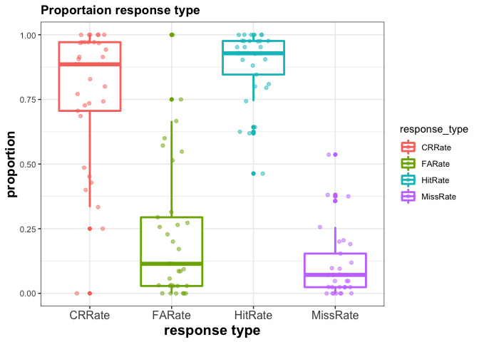

``` r
#d-p
ggplot(basic, aes(x = subID, y = d_p, color = as.factor(subID)))+
  geom_point(size=3)+
  labs(title="d prime", x = "subject", y = "d prime")+
  plotformat
```

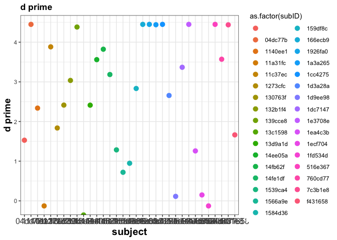

``` r
ggplot(basic,aes(d_p))+
  geom_histogram()+
  labs(title="d prime histogram", x = "d prime", y = "counts")+
  plotformat
```

    ## `stat_bin()` using `bins = 30`. Pick better value with `binwidth`.

    ## Warning: Removed 1 rows containing non-finite values (stat_bin).

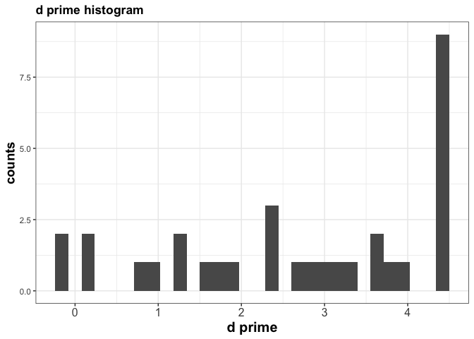

#### check subjects with low d-p & save survey data

``` r
removeSubdp = basic$subID[basic$d_p<d_p_thre | is.na(basic$d_p)]
sprintf("low d-prime subjects: %i",length(removeSubdp))
```

    ## [1] "low d-prime subjects: 5"

``` r
remainSubdp = basic$subID[basic$d_p>d_p_thre]
sprintf("pass d-prim threshould: %i", length(remainSubdp))
```

    ## [1] "pass d-prim threshould: 28"

``` r
#sprintf("remove d prime lower than %f. Sequence 01 remain subjects: %i; sequence 02 remain subjects: %i",d_p_thre, length(remain_dp_s1),length(remain_dp_s2))

for (irow in 1:dim(postsurvey)[1]){
  for (irow_basic in 1:dim(basic)[1]){
    if (postsurvey$SubID[irow]==basic$subID[irow_basic]){
      postsurvey$basic_id[irow] = as.character(basic$subID[irow_basic])
      postsurvey$d_p[irow] = basic$d_p[irow_basic]
      postsurvey$feature[irow] = unique(totalData$feature_index[totalData$subID==postsurvey$SubID[irow]])
    }
  }
}

#write.csv(postsurvey, file = paste0(postsurvey_dp_fname,".csv"))

##remove low dp 3rd run
num_lowdp = totalData %>% filter(subID %in% as.character(removeSubdp)) %>% group_by(feature_index) %>% summarize(num_trial = length(unique(subID)))
num_lowdp
```

    ## # A tibble: 2 x 2
    ##   feature_index num_trial
    ##   <fct>             <int>
    ## 1 2                     2
    ## 2 3                     3

``` r
totalData = totalData%>% filter(!subID %in% removeSubdp)
```

### by features -- within Features

There three features on an object that are manipulated. Here, I analysed subjects discrimination ability (d-prime) separated by features.

``` r
summarize = dplyr::summarize
##########
basicFeature = totalData  %>%group_by(subID,feature_index)%>% summarize(
            hit = sum(keys==1&SameDiff=="S"), 
            fa= sum(keys==1&SameDiff=="D"), 
            cr = sum(keys==0&SameDiff=="D"),
            miss = sum(keys==0&SameDiff=="S"),
            HitRate =sum(keys==1&SameDiff=="S")/sum(SameDiff=="S"), 
            FARate = sum(keys==1&SameDiff=="D")/sum(SameDiff=="D"), 
            CRRate = sum(keys==0&SameDiff=="D")/sum(SameDiff=="D"),
            MissRate = sum(keys==0&SameDiff=="S")/sum(SameDiff=="S"), 
            adjFARate = 1/(2*sum(SameDiff=="D")),
            adjHitRate = 1-(1/(2*sum(SameDiff=="S"))),
            d_p = qnorm(HitRate)-qnorm(FARate),
            adjd_p=qnorm(adjHitRate)-qnorm(adjFARate))

basicFeature$d_p[basicFeature$FARate==0 | basicFeature$HitRate==1]=
  basicFeature$adjd_p[basicFeature$FARate==0 | basicFeature$HitRate==1]

###
basicFeature_longform = gather(basicFeature, response_type, number_resp, HitRate,FARate,CRRate,MissRate)
head(basicFeature_longform)
```

    ## # A tibble: 6 x 12
    ## # Groups:   subID [6]
    ##   subID feature_index   hit    fa    cr  miss adjFARate adjHitRate   d_p
    ##   <fct> <fct>         <int> <int> <int> <int>     <dbl>      <dbl> <dbl>
    ## 1 ""    2                91    31    73    35  0.00476       0.996  1.13
    ## 2 04dc… 3               109    20    85    17  0.00476       0.996  1.98
    ## 3 1140… 2                94    11    87    20  0.00476       0.996  1.92
    ## 4 11c3… 1               113    12    93    13  0.00476       0.996  2.47
    ## 5 1273… 2               545   145   365    55  0.000952      0.999  1.70
    ## 6 1307… 2               109    17    87    17  0.00476       0.996  2.09
    ## # … with 3 more variables: adjd_p <dbl>, response_type <chr>,
    ## #   number_resp <dbl>

``` r
ggplot(basicFeature_longform, aes(x = response_type, y = number_resp, color = response_type))+
  geom_boxplot(fill = "white",lwd = 1)+
  geom_jitter(width=0.2,alpha = 0.5)+
  facet_wrap(~feature_index)+
  labs(title="Proportaion response type by feature", x = "response type", y = "proportion")+
  theme_facet()
```

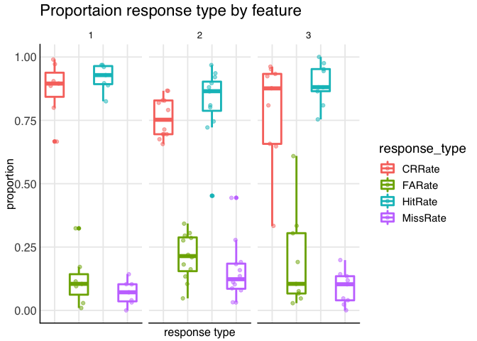

``` r
ggplot(basicFeature, aes(x = feature_index, y = d_p, group = feature_index, color = feature_index))+
  geom_boxplot(fill = "white",lwd = 1)+
  geom_jitter(width=0.2,alpha = 0.5)+
  plotformat
```

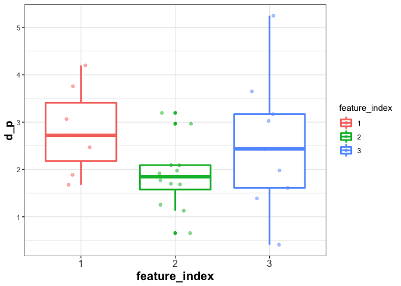

``` r
#ggplot(basicFeature, aes(x = subID, y = d_p, group = feature_index, color = feature_index))+
#  geom_point(size=3)+
#  plotformat
```

#### stats

``` r
basicFeature$feature_index[is.infinite(basicFeature$d_p)]
```

    ## factor(0)
    ## Levels: 1 2 3

``` r
basicFeature$subID[is.infinite(basicFeature$d_p)]
```

    ## factor(0)
    ## 34 Levels:  04dc77b 1140ee1 11a31fc 11c37ec 1273cfc 12ce948 ... f431658

``` r
feature_anova = aov(d_p~feature_index,basicFeature)
summary(feature_anova)
```

    ##               Df Sum Sq Mean Sq F value Pr(>F)
    ## feature_index  2  4.682   2.341   2.171  0.135
    ## Residuals     25 26.957   1.078

### by features by runs -- within Features

There were three task runs in total. Here, I would like to know whether the discrimination ability increase over learning (i.e. from the first to the third run).

``` r
summarize = dplyr::summarize
##########
basicFeature = totalData %>%group_by(subID,feature_index,run)%>% summarize(
            hit = sum(keys==1&SameDiff=="S"), 
            fa= sum(keys==1&SameDiff=="D"), 
            cr = sum(keys==0&SameDiff=="D"),
            miss = sum(keys==0&SameDiff=="S"),
            HitRate =sum(keys==1&SameDiff=="S")/sum(SameDiff=="S"), 
            FARate = sum(keys==1&SameDiff=="D")/sum(SameDiff=="D"), 
            CRRate = sum(keys==0&SameDiff=="D")/sum(SameDiff=="D"),
            MissRate = sum(keys==0&SameDiff=="S")/sum(SameDiff=="S"), 
            adjFARate = 1/(2*sum(SameDiff=="D")),
            adjHitRate = 1-(1/(2*sum(SameDiff=="S"))),
            d_p = qnorm(HitRate)-qnorm(FARate),
            adjd_p=qnorm(adjHitRate)-qnorm(adjFARate))

basicFeature$d_p[basicFeature$FARate==0 | basicFeature$HitRate==1]=
  basicFeature$adjd_p[basicFeature$FARate==0 | basicFeature$HitRate==1]

###
ggplot(basicFeature, aes(x = feature_index, y = d_p, group = feature_index, color = feature_index))+
  geom_boxplot(fill = "white",lwd = 1)+
  geom_jitter(width=0.2,alpha = 0.5)+
  facet_wrap(~run)+
  plotformat
```

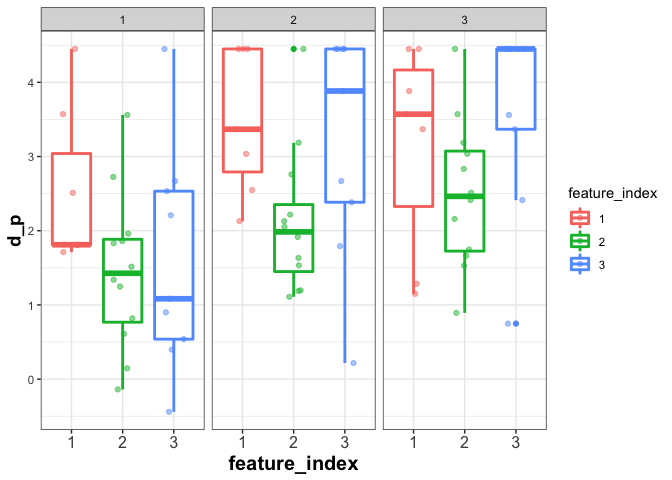 \#\#\#\#stats

``` r
basicFeature_run3 = basicFeature %>% filter(run==3, !is.infinite(d_p))
anovaFeature3rdRun = aov(d_p~feature_index,basicFeature_run3)
summary(anovaFeature3rdRun)
```

    ##               Df Sum Sq Mean Sq F value Pr(>F)
    ## feature_index  2   6.35   3.177   2.234  0.128
    ## Residuals     25  35.56   1.422

``` r
summarize = dplyr::summarize
compareFeature3rdRun = basicFeature  %>%filter(run==3,!is.infinite(d_p)) %>% group_by(feature_index) %>%summarize(meanD_p = mean(d_p),std =sd(d_p),med = median(d_p) )
compareFeature3rdRun
```

    ## # A tibble: 3 x 4
    ##   feature_index meanD_p   std   med
    ##   <fct>           <dbl> <dbl> <dbl>
    ## 1 1                3.16 1.39   3.57
    ## 2 2                2.50 0.988  2.46
    ## 3 3                3.59 1.28   4.45

### within a feature: levels

Each feature of an object has 70 levels (or 70 variations). The levels are equally spaced. Here, I would like to know how obejcts with different numbers of levels apart were perceived psychologically. In other words, objects with 10 levels apart in feature 01 should look more different than objects with 5 levels apart in feature 01.

``` r
summarize = dplyr::summarize

basicLevel = totalData %>% filter(keys>=0)%>% group_by(subID,level_diff)%>% 
summarize(
            hit = sum(keys==1&SameDiff=="S"), 
            fa= sum(keys==1&SameDiff=="D"), 
            cr = sum(keys==0&SameDiff=="D"),
            miss = sum(keys==0&SameDiff=="S"),
            HitRate =sum(keys==1&SameDiff=="S")/sum(SameDiff=="S"), 
            FARate = sum(keys==1&SameDiff=="D")/sum(SameDiff=="D"), 
            CRRate = sum(keys==0&SameDiff=="D")/sum(SameDiff=="D"),
            MissRate = sum(keys==0&SameDiff=="S")/sum(SameDiff=="S"))

####
basicLevel_longform = gather(basicLevel, response_type, resp_rate, HitRate,FARate,CRRate,MissRate)
head(basicLevel_longform)
```

    ## # A tibble: 6 x 8
    ## # Groups:   subID [1]
    ##   subID level_diff   hit    fa    cr  miss response_type resp_rate
    ##   <fct> <fct>      <int> <int> <int> <int> <chr>             <dbl>
    ## 1 ""    0             91     0     0    35 HitRate           0.722
    ## 2 ""    1              0    12     8     0 HitRate         NaN    
    ## 3 ""    2              0     9    12     0 HitRate         NaN    
    ## 4 ""    3              0     4    17     0 HitRate         NaN    
    ## 5 ""    4              0     4    17     0 HitRate         NaN    
    ## 6 ""    5              0     2    19     0 HitRate         NaN

``` r
ggplot(basicLevel_longform, aes(x = response_type, y = resp_rate, color = response_type))+
  geom_boxplot(fill = "white",lwd = 1)+
  geom_jitter(width=0.2,alpha = 0.5)+
  facet_wrap(~level_diff,nrow = 1)+
  labs(title="Proportaion response type by difficulty level", x = "response type", y = "proportion")+
  theme_facet()
```

    ## Warning: Removed 336 rows containing non-finite values (stat_boxplot).

    ## Warning: Removed 336 rows containing missing values (geom_point).

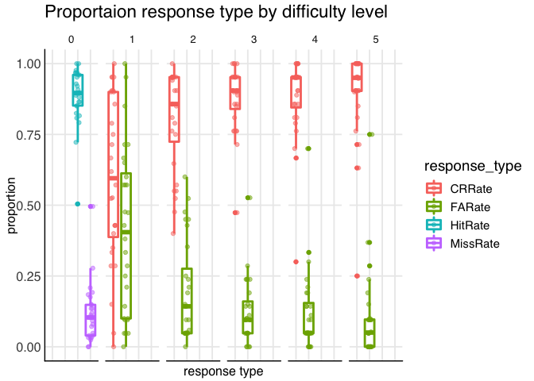

``` r
###########
basicLevelFeature = totalData %>% filter(keys>=0)%>%group_by(subID,level_diff,feature_index)%>% 
summarize(  accuracy = sum(accuracy)/length(subID),
            hit = sum(keys==1&SameDiff=="S"), 
            fa= sum(keys==1&SameDiff=="D"), 
            cr = sum(keys==0&SameDiff=="D"),
            miss = sum(keys==0&SameDiff=="S"),
            HitRate =sum(keys==1&SameDiff=="S")/sum(SameDiff=="S"), 
            FARate = sum(keys==1&SameDiff=="D")/sum(SameDiff=="D"), 
            CRRate = sum(keys==0&SameDiff=="D")/sum(SameDiff=="D"),
            MissRate = sum(keys==0&SameDiff=="S")/sum(SameDiff=="S"))
  basicLevelFeature_longform = gather(basicLevelFeature, response_type, resp_rate, HitRate,FARate,CRRate,MissRate)
  head(basicLevelFeature_longform)
```

    ## # A tibble: 6 x 10
    ## # Groups:   subID, level_diff [6]
    ##   subID level_diff feature_index accuracy   hit    fa    cr  miss
    ##   <fct> <fct>      <fct>            <dbl> <int> <int> <int> <int>
    ## 1 ""    0          2                0.722    91     0     0    35
    ## 2 ""    1          2                0.4       0    12     8     0
    ## 3 ""    2          2                0.571     0     9    12     0
    ## 4 ""    3          2                0.810     0     4    17     0
    ## 5 ""    4          2                0.810     0     4    17     0
    ## 6 ""    5          2                0.905     0     2    19     0
    ## # … with 2 more variables: response_type <chr>, resp_rate <dbl>

``` r
  ggplot(basicLevelFeature_longform, aes(x = response_type, y = resp_rate, color = response_type))+
    geom_boxplot(fill = "white",lwd = 1)+
    geom_jitter(width=0.2,alpha = 0.5)+
    facet_wrap(feature_index~level_diff,nrow = 3,strip.position = "bottom")+
    labs(title="Proportaion resp type within Feature by difficulty level", x = "level diff", y = "proportion")+
    theme_facet()
```

    ## Warning: Removed 336 rows containing non-finite values (stat_boxplot).

    ## Warning: Removed 336 rows containing missing values (geom_point).

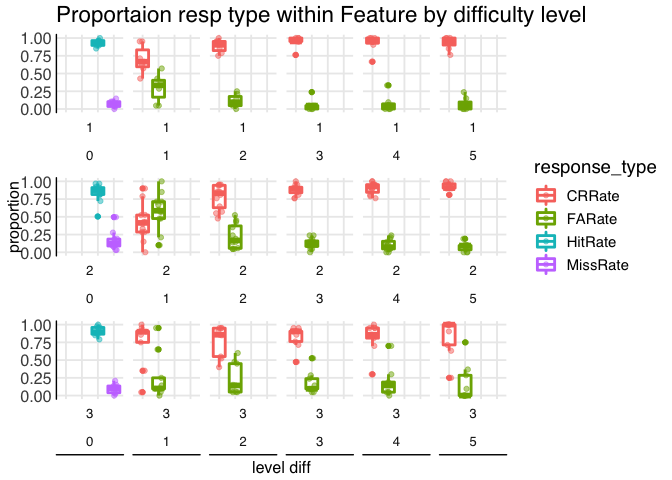

``` r
  ggplot(basicLevelFeature, aes(x=feature_index,y=accuracy,color = feature_index))+
    geom_boxplot(fill = "white",lwd = 1)+
    geom_jitter(width=0.2,alpha = 0.5)+
    facet_wrap(~level_diff)+
    plotformat
```

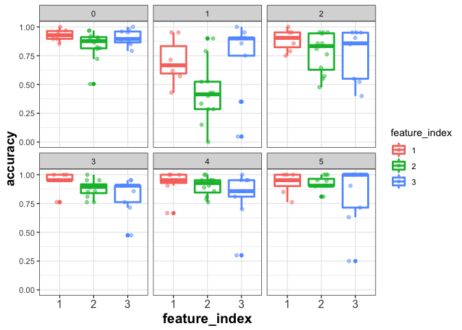

``` r
  ggplot(basicLevelFeature, aes(x=level_diff,y=accuracy,color = feature_index))+
    geom_boxplot(fill = "white",lwd = 1)+
    plotformat
```

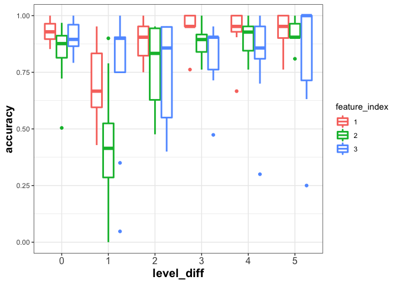

``` r
  ggplot(filter(basicLevelFeature,feature_index==1), aes(x=level_diff,y=accuracy))+
    geom_boxplot(fill = "white",lwd = 1)+
    geom_jitter(width=0.2,alpha = 0.5)+
    labs(title="Feauture 01", x = "level diff", y = "accuracy")+
    ylim(0,1)+
    plotformat
```

    ## Warning: Removed 7 rows containing missing values (geom_point).

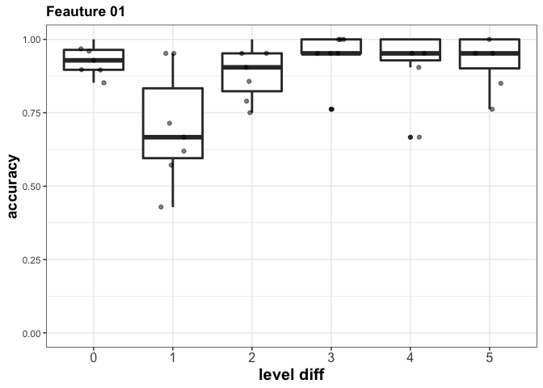

``` r
  ggplot(filter(basicLevelFeature,feature_index==2), aes(x=level_diff,y=accuracy))+
    geom_boxplot(fill = "white",lwd = 1)+
    geom_jitter(width=0.2,alpha = 0.5)+
    labs(title="Feauture 02", x = "level diff", y = "accuracy")+
    ylim(0,1)+
    plotformat
```

    ## Warning: Removed 1 rows containing missing values (geom_point).

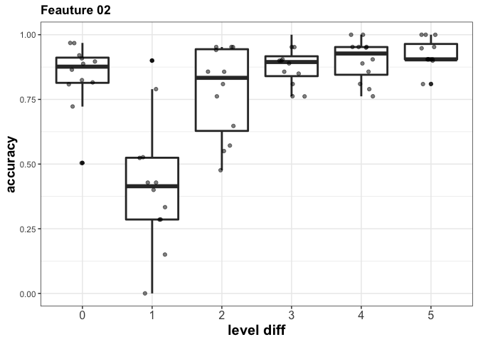

``` r
  ggplot(filter(basicLevelFeature,feature_index==3), aes(x=level_diff,y=accuracy))+
    geom_boxplot(fill = "white",lwd = 1)+
    geom_jitter(width=0.2,alpha = 0.5)+
    labs(title="Feauture 03", x = "level diff", y = "accuracy")+
    ylim(0,1)+
    plotformat
```

    ## Warning: Removed 4 rows containing missing values (geom_point).

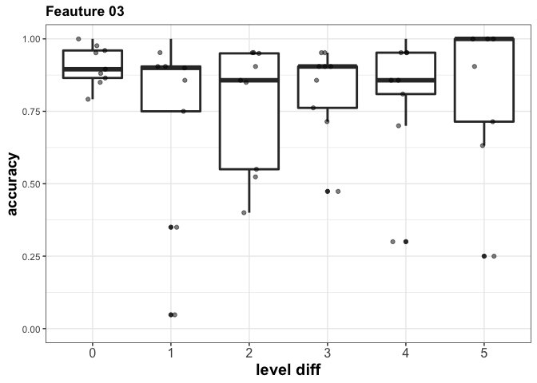

#### stats

``` r
anovaFeatureLevel = aov(accuracy~feature_index+level_diff,basicLevelFeature)
summary(anovaFeatureLevel)
```

    ##                Df Sum Sq Mean Sq F value   Pr(>F)    
    ## feature_index   2  0.244  0.1219   4.023   0.0197 *  
    ## level_diff      5  1.928  0.3856  12.719 2.06e-10 ***
    ## Residuals     160  4.850  0.0303                     
    ## ---
    ## Signif. codes:  0 '***' 0.001 '**' 0.01 '*' 0.05 '.' 0.1 ' ' 1

``` r
summarize = dplyr::summarize
compareFeatures = basicLevelFeature  %>%group_by(feature_index,level_diff) %>%summarize(meanAccuracy = mean(accuracy),std =sd(accuracy) )
compareFeatures
```

    ## # A tibble: 18 x 4
    ## # Groups:   feature_index [?]
    ##    feature_index level_diff meanAccuracy    std
    ##    <fct>         <fct>             <dbl>  <dbl>
    ##  1 1             0                 0.929 0.0509
    ##  2 1             1                 0.701 0.194 
    ##  3 1             2                 0.887 0.0920
    ##  4 1             3                 0.946 0.0844
    ##  5 1             4                 0.925 0.119 
    ##  6 1             5                 0.931 0.0916
    ##  7 2             0                 0.841 0.127 
    ##  8 2             1                 0.421 0.249 
    ##  9 2             2                 0.777 0.174 
    ## 10 2             3                 0.878 0.0742
    ## 11 2             4                 0.902 0.0810
    ## 12 2             5                 0.928 0.0556
    ## 13 3             0                 0.908 0.0684
    ## 14 3             1                 0.741 0.324 
    ## 15 3             2                 0.771 0.217 
    ## 16 3             3                 0.825 0.155 
    ## 17 3             4                 0.820 0.216 
    ## 18 3             5                 0.833 0.260

### separate by run

``` r
basicLevelFeature = totalData %>% filter(keys>=0)%>%group_by(subID,level_diff,feature_index,run)%>% 
summarize(  accuracy = sum(accuracy)/length(subID),
            hit = sum(keys==1&SameDiff=="S"), 
            fa= sum(keys==1&SameDiff=="D"), 
            cr = sum(keys==0&SameDiff=="D"),
            miss = sum(keys==0&SameDiff=="S"),
            HitRate =sum(keys==1&SameDiff=="S")/sum(SameDiff=="S"), 
            FARate = sum(keys==1&SameDiff=="D")/sum(SameDiff=="D"), 
            CRRate = sum(keys==0&SameDiff=="D")/sum(SameDiff=="D"),
            MissRate = sum(keys==0&SameDiff=="S")/sum(SameDiff=="S"))
  basicLevelFeature_longform = gather(basicLevelFeature, response_type, resp_rate, HitRate,FARate,CRRate,MissRate)
  head(basicLevelFeature_longform)
```

    ## # A tibble: 6 x 11
    ## # Groups:   subID, level_diff, feature_index [2]
    ##   subID level_diff feature_index   run accuracy   hit    fa    cr  miss
    ##   <fct> <fct>      <fct>         <int>    <dbl> <int> <int> <int> <int>
    ## 1 ""    0          2                 1    0.714    30     0     0    12
    ## 2 ""    0          2                 2    0.643    27     0     0    15
    ## 3 ""    0          2                 3    0.810    34     0     0     8
    ## 4 ""    1          2                 1    0.333     0     4     2     0
    ## 5 ""    1          2                 2    0.429     0     4     3     0
    ## 6 ""    1          2                 3    0.429     0     4     3     0
    ## # … with 2 more variables: response_type <chr>, resp_rate <dbl>

``` r
  ggplot(filter(basicLevelFeature,feature_index==1), aes(x=level_diff,y=accuracy,group = level_diff,color=subID))+
    geom_boxplot(fill = "white",lwd = 1)+
    geom_jitter(width=0.2,alpha = 0.5)+
    labs(title="Feauture 01", x = "level diff", y = "accuracy")+
    ylim(0,1)+
    facet_wrap(~run)+
    plotformat
```

    ## Warning: Removed 32 rows containing missing values (geom_point).

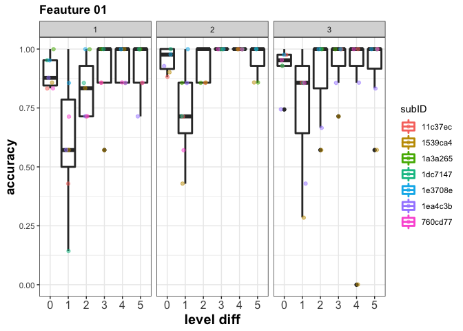

``` r
  ggplot(filter(basicLevelFeature,feature_index==2), aes(x=level_diff,y=accuracy,group = level_diff,color=subID))+
    geom_boxplot(fill = "white",lwd = 1)+
    geom_jitter(width=0.2,alpha = 0.5)+
    labs(title="Feauture 02", x = "level diff", y = "accuracy")+
    ylim(0,1)+
    facet_wrap(~run)+
    plotformat
```

    ## Warning: Removed 42 rows containing missing values (geom_point).

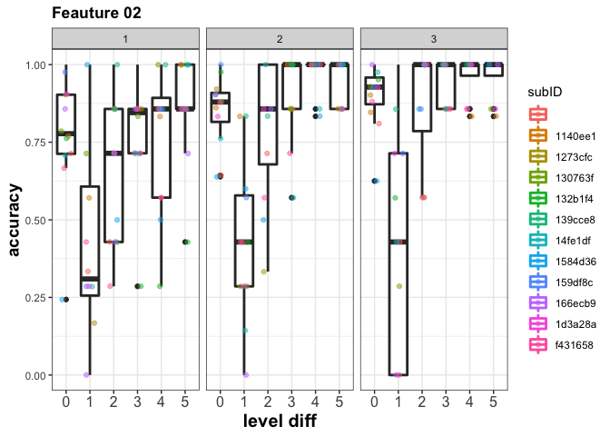

``` r
  ggplot(filter(basicLevelFeature,feature_index==3), aes(x=level_diff,y=accuracy,group = level_diff,color=subID))+
    geom_boxplot(fill = "white",lwd = 1)+
    geom_jitter(width=0.2,alpha = 0.5)+
    labs(title="Feauture 03", x = "level diff", y = "accuracy")+
    ylim(0,1)+
    facet_wrap(~run)+
    plotformat
```

    ## Warning: Removed 42 rows containing missing values (geom_point).

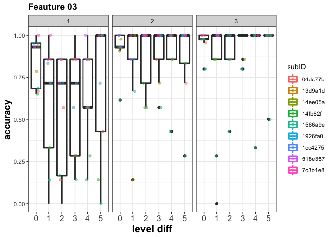

#### stats

``` r
anovaFeatureLevel = aov(accuracy~feature_index+level_diff+run,basicLevelFeature)
summary(anovaFeatureLevel)
```

    ##                Df Sum Sq Mean Sq F value   Pr(>F)    
    ## feature_index   2  0.731  0.3656   7.815 0.000456 ***
    ## level_diff      5  5.813  1.1627  24.855  < 2e-16 ***
    ## run             1  1.797  1.7972  38.420  1.2e-09 ***
    ## Residuals     495 23.155  0.0468                     
    ## ---
    ## Signif. codes:  0 '***' 0.001 '**' 0.01 '*' 0.05 '.' 0.1 ' ' 1

``` r
anovaFeatureLevel3rdRun = aov(accuracy~feature_index+level_diff,filter(basicLevelFeature,run==3))
summary(anovaFeatureLevel3rdRun)
```

    ##                Df Sum Sq Mean Sq F value   Pr(>F)    
    ## feature_index   2  0.151  0.0754    1.77    0.174    
    ## level_diff      5  2.296  0.4591   10.78 5.98e-09 ***
    ## Residuals     160  6.812  0.0426                     
    ## ---
    ## Signif. codes:  0 '***' 0.001 '**' 0.01 '*' 0.05 '.' 0.1 ' ' 1

``` r
anovaFeatureLevel3rdRun_same = aov(accuracy~feature_index,filter(basicLevelFeature,run==3 & level_diff==0))
summary(anovaFeatureLevel3rdRun_same)
```

    ##               Df Sum Sq  Mean Sq F value Pr(>F)
    ## feature_index  2 0.0227 0.011348   1.455  0.253
    ## Residuals     25 0.1950 0.007799

``` r
anovaFeatureLevel3rdRun_l01 = aov(accuracy~feature_index,filter(basicLevelFeature,run==3 & level_diff==1))
summary(anovaFeatureLevel3rdRun_l01)
```

    ##               Df Sum Sq Mean Sq F value Pr(>F)  
    ## feature_index  2 0.8477  0.4239   3.495 0.0459 *
    ## Residuals     25 3.0320  0.1213                 
    ## ---
    ## Signif. codes:  0 '***' 0.001 '**' 0.01 '*' 0.05 '.' 0.1 ' ' 1

``` r
summarize = dplyr::summarize
compareFeatures = basicLevelFeature  %>% filter(run==3) %>% group_by(feature_index,level_diff) %>%summarize(meanAccuracy = mean(accuracy),std =sd(accuracy),med = median(accuracy) )
compareFeatures
```

    ## # A tibble: 18 x 5
    ## # Groups:   feature_index [?]
    ##    feature_index level_diff meanAccuracy    std   med
    ##    <fct>         <fct>             <dbl>  <dbl> <dbl>
    ##  1 1             0                 0.929 0.0860 0.952
    ##  2 1             1                 0.755 0.282  0.857
    ##  3 1             2                 0.891 0.188  1    
    ##  4 1             3                 0.939 0.112  1    
    ##  5 1             4                 0.837 0.373  1    
    ##  6 1             5                 0.915 0.164  1    
    ##  7 2             0                 0.898 0.104  0.928
    ##  8 2             1                 0.417 0.363  0.429
    ##  9 2             2                 0.869 0.187  1    
    ## 10 2             3                 0.952 0.0703 1    
    ## 11 2             4                 0.962 0.0685 1    
    ## 12 2             5                 0.962 0.0685 1    
    ## 13 3             0                 0.964 0.0639 0.976
    ## 14 3             1                 0.778 0.372  1    
    ## 15 3             2                 0.905 0.189  1    
    ## 16 3             3                 0.962 0.0769 1    
    ## 17 3             4                 0.926 0.222  1    
    ## 18 3             5                 0.944 0.167  1
